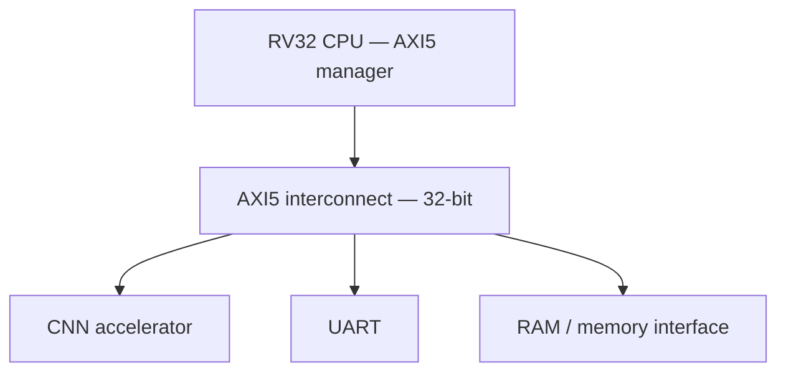
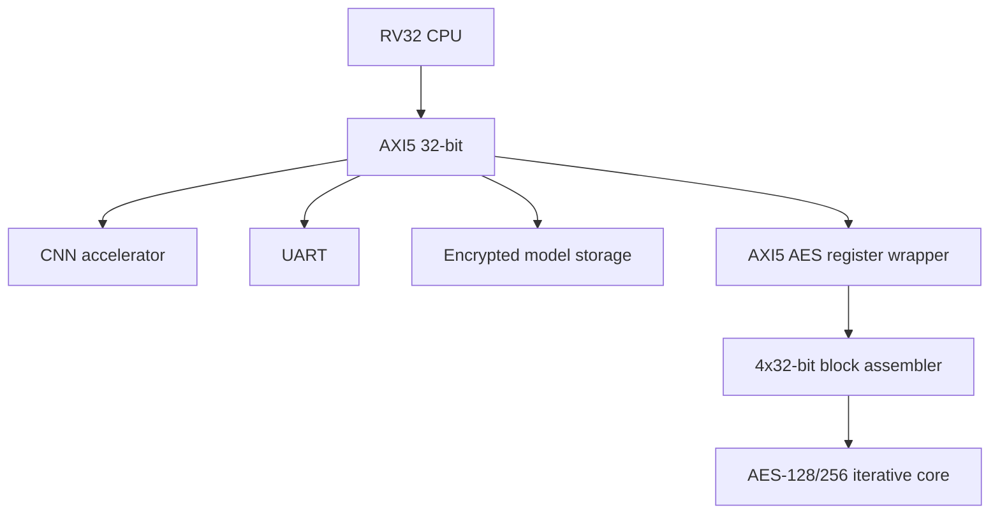
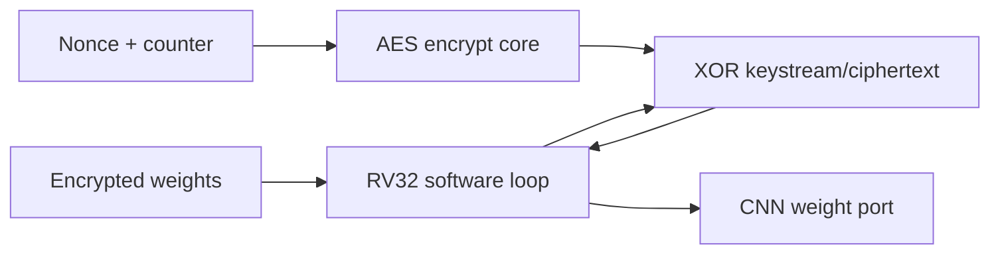
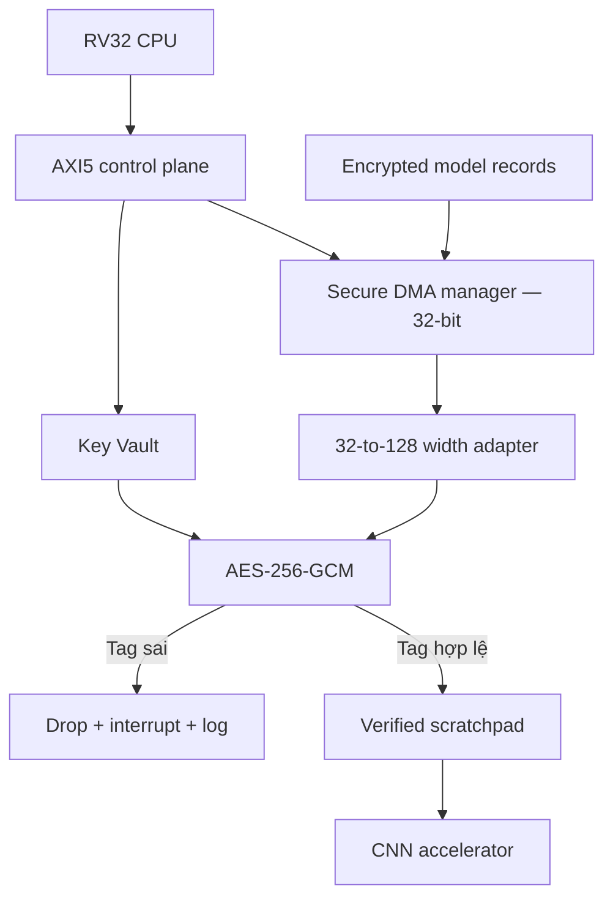
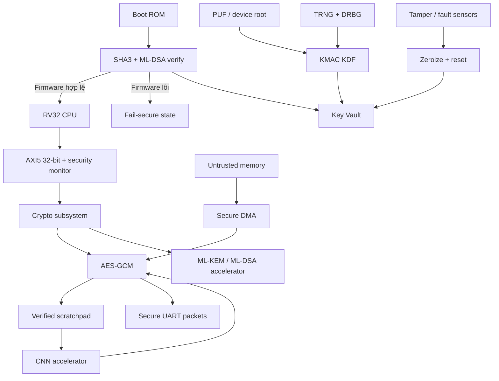
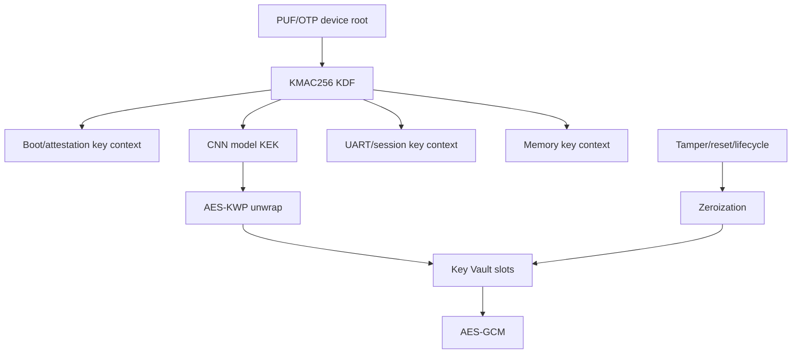
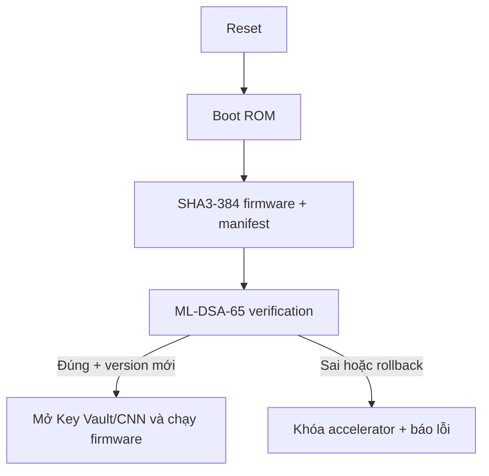
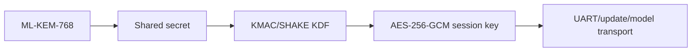
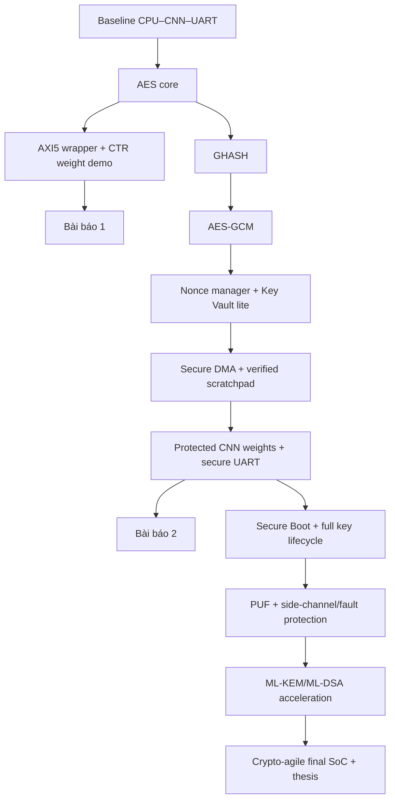

# Đặc tả kiến trúc dự án Secure CNN SoC v1.0

**Tên đề tài làm việc**  
**Thiết kế SoC RISC-V 32-bit bảo mật cho tăng tốc CNN, tích hợp AES-GCM, quản lý khóa và mật mã hậu lượng tử trên AXI5**

**Ngày chốt kiến trúc v1.0:** 17-08-2026  
**Thời gian dự kiến:** 12 tháng  
**Mục tiêu gần:** một bản thảo sau 2 tuần và một bản thảo sau 3 tháng

---

## 1. Quyết định kiến trúc đã chốt

| Hạng mục | Quyết định v1.0 |
|---|---|
| CPU | RISC-V 32-bit, little-endian |
| Bus hệ thống | AXI5, data width 32-bit |
| Khối hiện có | CPU, CNN accelerator, UART, AXI5 interconnect |
| Tài sản CNN bảo vệ đầu tiên | Trọng số mô hình CNN |
| Thuật toán đầu tiên | AES-128/256 core; ưu tiên AES-256 cho luồng bảo mật |
| Chế độ demo đầu tiên | AES-256-CTR để giải mã trọng số bằng AES-encrypt datapath |
| Chế độ dùng trong hệ thống bảo mật | AES-256-GCM, tag 128-bit, IV/nonce 96-bit |
| Kiến trúc AES ban đầu | Iterative, 1 round/chu kỳ, datapath nội bộ 128-bit |
| Giao diện AES ban đầu | AXI5 subordinate 32-bit, memory-mapped, single-beat |
| Giao diện dữ liệu nâng cấp | Secure DMA AXI5 manager 32-bit + bộ gom/tách 32/128-bit |
| Hậu lượng tử | ML-KEM-768 cho thiết lập khóa; ML-DSA-65 cho Secure Boot/attestation |
| Phạm vi physical security | PUF-derived key, zeroization, side-channel/fault countermeasures |

> **Định nghĩa quan trọng:** “mã hóa CNN” trong dự án này không có nghĩa mã hóa mạch nhân chập. Đối tượng được mã hóa là trọng số mô hình, input, feature map hoặc output. Phiên bản đầu tiên chỉ bảo vệ **trọng số CNN khi lưu hoặc truyền bên ngoài vùng tin cậy**.

---

## 2. Mục tiêu và câu hỏi nghiên cứu

### 2.1. Mục tiêu kỹ thuật

Xây dựng một SoC có khả năng:

1. Chạy CPU RISC-V 32-bit, CNN và UART trên AXI5 32-bit như hệ thống hiện tại.
2. Mã hóa/giải mã trọng số CNN bằng phần cứng AES.
3. Xác thực trọng số bằng AES-GCM trước khi CNN được phép sử dụng.
4. Cách ly khóa khỏi phần mềm và peripheral không được cấp quyền.
5. Chỉ khởi động firmware hợp lệ bằng Secure Boot.
6. Phát hiện replay, fault và tamper theo phạm vi của nguyên mẫu.
7. Thiết lập khóa phiên hậu lượng tử bằng ML-KEM và xác thực firmware bằng ML-DSA.

### 2.2. Câu hỏi nghiên cứu trung tâm

> Có thể bảo vệ tính bí mật, toàn vẹn và tính mới của trọng số CNN trên một SoC AXI5 32-bit bằng AES-GCM mà vẫn giữ overhead suy luận thấp, đồng thời tạo một đường nâng cấp hợp lý tới quản lý khóa an toàn và hậu lượng tử hay không?

### 2.3. Chỉ số đánh giá chính

- Tính đúng: NIST Known Answer Tests và randomized tests.
- Hiệu năng: latency, throughput, CNN inference time và AXI utilization.
- Tài nguyên: LUT, FF, BRAM, DSP, area tương đương và Fmax.
- Năng lượng: power hoặc energy/bit nếu công cụ và board hỗ trợ.
- Bảo mật chức năng: reject sai tag, chống replay, khóa không đọc ngược, zeroization.
- Bảo mật vật lý: kết quả fault injection và leakage test trong phạm vi thiết bị đo.
- PQC: cycles, throughput, memory footprint và area của NTT/Keccak accelerator.

---

## 3. Phạm vi “bảo vệ CNN”

| Đối tượng | Có trong dự án? | Giai đoạn | Cơ chế |
|---|---:|---|---|
| Trọng số CNN trong Flash/DRAM | Có, mục tiêu đầu tiên | Tuần 1–12 | AES-CTR thử nghiệm → AES-GCM chính thức |
| Trọng số đang truyền trên AXI | Có một phần | Tháng 2–3 | Secure DMA → GCM → secure scratchpad → CNN |
| Input CNN | Có, nâng cấp | Tháng 3–4 | AES-GCM record/packet |
| Feature map ngoài chip | Có nếu thiết kế ghi ra DRAM | Tháng 4–6 | Memory encryption + integrity/freshness |
| Output CNN qua UART | Có | Tháng 2–3 | AES-GCM packet + sequence counter |
| RTL/netlist của CNN | Không do AES peripheral bảo vệ | Ngoài phạm vi ban đầu | Cần bitstream encryption, obfuscation hoặc secure configuration |
| Trọng số hard-code trong RTL/ROM nội | Không giải quyết chỉ bằng AES peripheral | Cần xác nhận thiết kế hiện tại | Chuyển sang encrypted model load hoặc bảo vệ bitstream |

### 3.1. Ba trường hợp lưu trọng số

1. **Trọng số nằm trong external Flash/DRAM:** phù hợp nhất; mã hóa dữ liệu lưu và giải mã trước CNN.
2. **CPU ghi trọng số vào thanh ghi/RAM của CNN:** nguyên mẫu đầu dùng CPU + AES; giai đoạn sau dùng Secure DMA.
3. **Trọng số được hard-code trong RTL/bitstream:** AES peripheral không che giấu được trọng số; phải thay kiến trúc nạp model hoặc dùng cơ chế bảo vệ bitstream của FPGA.

Kiến trúc v1.0 giả định trường hợp 1 hoặc 2.

---

## 4. Threat model theo từng mốc

### 4.1. Tài sản

- AES key, session key, root secret.
- Trọng số, input, feature map và output CNN.
- Firmware và cấu hình accelerator.
- Nonce, version counter và security policy.
- Measurement dùng cho attestation.

### 4.2. Thành phần tin cậy và không tin cậy

| Miền | Giả định |
|---|---|
| Boot ROM | Tin cậy và bất biến |
| AES/GCM, Key Vault, security monitor | Tin cậy |
| CPU sau Secure Boot | Tin cậy có điều kiện |
| CNN accelerator | Tin cậy về chức năng; chỉ nhận dữ liệu đã xác thực ở kiến trúc cuối |
| AXI interconnect | Tin cậy ban đầu; được bổ sung policy monitor về sau |
| External Flash/DRAM | Không tin cậy |
| UART và thiết bị ngoài SoC | Không tin cậy |
| Firmware chưa được xác thực | Không tin cậy |

### 4.3. Khả năng kẻ tấn công

| Mốc | Kẻ tấn công có thể |
|---|---|
| 2 tuần | Quan sát hoặc sao chép dữ liệu lưu/truyền ngoài SoC |
| 3 tháng | Sửa ciphertext/tag, tráo tensor, replay dữ liệu, gửi packet UART giả |
| 5 tháng | Cài firmware/update không hợp lệ hoặc thử đọc Key Vault |
| 8 tháng | Thực hiện clock/voltage glitch và đo power/EM trong phạm vi phòng lab |
| 10–12 tháng | Thu thập public-key traffic để tấn công về sau bằng máy lượng tử |

### 4.4. Ngoài phạm vi của nguyên mẫu đầu

- Decapsulation bằng phòng thí nghiệm bán dẫn cao cấp.
- Chứng nhận Common Criteria/FIPS 140 chính thức.
- Bảo vệ tuyệt đối trước mọi side-channel.
- Bảo vệ RTL/netlist CNN chỉ bằng AES peripheral.

---

## 5. Kiến trúc hiện tại và kiến trúc mục tiêu

### 5.1. Baseline hiện tại



Không có mật mã, Key Vault hoặc Secure Boot. Trọng số và kết quả CNN có thể xuất hiện dưới dạng rõ.

### 5.2. Kiến trúc đợt 1 — AES sidecar trong 2 tuần



**Vai trò:** CPU đưa bốn word 32-bit vào wrapper để tạo một block 128-bit. AES xử lý block rồi kết quả được tách thành bốn word cho CPU đọc.

**Không thay thế:** CNN, UART hoặc AXI interconnect.

### 5.3. Luồng giải mã trọng số đợt 1



Đợt 1 dùng AES-CTR vì mã hóa và giải mã đều chỉ cần **AES encryption datapath**. Điều này tránh phải làm inverse AES trước khi xây GCM.

**Giới hạn:** plaintext vẫn đi qua CPU và AXI trên đường tới CNN; dữ liệu chưa có authentication tag nên kẻ tấn công vẫn có thể sửa ciphertext.

### 5.4. Kiến trúc 3 tháng — authenticated weight streaming



**Nguyên tắc secure-commit:** plaintext không được đưa sang CNN trước khi tag của record/tile được xác minh. Nếu cần streaming hiệu năng cao, dùng hai scratchpad: CNN đọc buffer A trong khi GCM xác thực buffer B.

### 5.5. Kiến trúc cuối khóa luận



---

## 6. Phân rã module RTL

| Module | Mục đích | Input/output chính | Có ở mốc | Nếu thiếu |
|---|---|---|---|---|
| `aes_sbox` | SubBytes | 8-bit → 8-bit | Tuần 1 | Không thực hiện được AES round |
| `aes_mixcolumns` | MixColumns | 128-bit → 128-bit | Tuần 1 | AES output sai |
| `aes_key_expand` | Sinh round key | key, round → round key | Tuần 1 | Không thể chạy đủ round |
| `aes_round` | Một AES round | state, round key | Tuần 1 | Không có datapath AES |
| `aes_core` | FSM AES-128/256 | start/key/block → done/result | Tuần 1 | Không có crypto engine |
| `axi5_aes_regs` | CPU truy cập AES | AXI5 32-bit ↔ AES command/status | Tuần 2 | AES không tích hợp SoC |
| `block_assembler_32_128` | Ghép/tách bốn word | 4×32 ↔ 128 bit | Tuần 2 | Sai dữ liệu hoặc sai endian |
| `aes_ctr_engine` | CTR keystream và XOR | counter, ciphertext → plaintext | Tuần 2 | Chưa demo được bảo vệ trọng số |
| `ghash_core` | Xác thực GCM | blocks, H → GHASH | Tuần 3 | GCM không có tag |
| `aes_gcm_core` | AEAD | key, nonce, AAD, data ↔ data, tag | Tuần 4 | Chỉ có confidentiality |
| `nonce_manager` | Bảo đảm IV duy nhất | boot/session/record counter | Tuần 4–5 | Lặp nonce có thể phá GCM |
| `secure_dma` | Chuyển dữ liệu không qua CPU | AXI5 manager + descriptors | Tuần 5–6 | Overhead CPU và bus cao |
| `verified_scratchpad` | Cách ly plaintext chưa xác thực | GCM output → CNN | Tuần 7–8 | CNN có thể dùng dữ liệu sai trước khi tag fail |
| `cnn_secure_frontend` | Chỉ commit tensor hợp lệ | tensor metadata/data → CNN port | Tuần 8–9 | Không ràng buộc model/layer/address |
| `uart_secure_packet` | Packet AES-GCM và chống replay | UART byte stream ↔ secure records | Tuần 9 | UART vẫn lộ hoặc bị sửa |
| `axi_security_monitor` | Kiểm tra privilege/ID/address | AXI attributes → allow/deny | Tuần 9–10 | Master trái phép có thể điều khiển crypto |
| `key_vault` | Cách ly và zeroize khóa | provisioning/KDF → crypto keys | Tuần 9–10 | Phần mềm có thể lấy khóa |
| `aes_kwp` | Bọc key blob | KEK, key blob ↔ wrapped blob | Tháng 4 | Khóa lưu ngoài chip thiếu bảo vệ chuẩn |
| `sha3_keccak` | Hash/KMAC và tái sử dụng cho PQC | message → hash/XOF | Tháng 4–6 | Thiếu Secure Boot/PQC shared primitive |
| `secure_boot_ctrl` | Xác thực boot, anti-rollback | ROM/Flash/signature/version | Tháng 4–5 | Firmware giả có thể chiếm SoC |
| `trng_health` | Entropy và health tests | entropy source → raw entropy | Tháng 5–6 | Key/nonce có thể dự đoán |
| `ctr_drbg` | Sinh bit ngẫu nhiên tốc độ cao | seed → random bits | Tháng 5–6 | TRNG thô khó cấp đủ tốc độ |
| `puf_frontend` | Tái tạo device root | PUF response/helper data | Tháng 6–7 | Phải lưu root key cố định |
| `aes_masked_core` | Giảm leakage | masked state/key/randomness | Tháng 6–8 | AES dễ bị DPA/CPA hơn |
| `fault_monitor` | Phát hiện lỗi/glitch | redundant checks/sensors | Tháng 7–8 | Fault có thể làm sai kiểm tra bảo mật |
| `ntt_accelerator` | Tăng tốc lattice arithmetic | polynomial ↔ NTT | Tháng 8–10 | ML-KEM/ML-DSA chạy chậm trên RV32 |
| `pqc_ctrl` | Điều phối ML-KEM/ML-DSA | descriptors/status/memory | Tháng 8–10 | PQC không tích hợp được hệ thống |
| `crypto_policy_ctrl` | Crypto-agility và lifecycle | policy/version/lifecycle state | Tháng 10–11 | Khó thay thuật toán hoặc khóa chế độ yếu |

---

## 7. Thiết kế AES đợt 1

### 7.1. Kiến trúc core

- Datapath: 128-bit.
- Kiến trúc: iterative, dùng lại một AES round.
- AES-128: 10 round; AES-256: 14 round.
- Key schedule: on-the-fly ở phiên bản đầu.
- Chỉ cần AES encryption datapath trong đợt 1–2 vì CTR và GCM dùng cùng primitive cho cả hai chiều.
- FSM đề xuất: `IDLE → INIT_ADDKEY → ROUND → FINAL_ROUND → DONE`.
- Các cổng an toàn: `zeroize`, `key_valid`, `error`.

### 7.2. Internal interface đề xuất

```systemverilog
module aes_core (
    input  logic         clk,
    input  logic         rst_n,
    input  logic         start,
    input  logic         zeroize,
    input  logic         key_len_256,
    input  logic [255:0] key,
    input  logic [127:0] block_in,
    output logic         busy,
    output logic         done,
    output logic         error,
    output logic [127:0] block_out
);
```

Đây là contract logic, chưa phải RTL hoàn chỉnh. Cần chốt byte ordering bằng test vector trước khi code các module phụ thuộc.

### 7.3. AXI5 32-bit wrapper

- Vai trò: AXI5 subordinate memory-mapped.
- Phiên bản đầu chỉ cần single-beat transaction cho control plane.
- `WDATA[31:0]`, `WSTRB[3:0]`, read/write response đúng protocol.
- Không nhận lệnh `START` nếu `busy=1` hoặc key chưa đầy đủ.
- Key register là write-only; đọc trả 0 hoặc response lỗi theo policy đã chọn.
- Phiên bản đầu CPU polling `DONE`; interrupt là nâng cấp cuối tuần 2.
- Datapath AES vẫn 128-bit; wrapper chỉ chịu trách nhiệm ghép/tách bốn word.

### 7.4. Register map đề xuất

Base address phải được chọn sau khi kiểm tra address map hiện tại. Bảng dưới chỉ định **offset**.

| Offset | Tên | R/W | Chức năng |
|---:|---|---|---|
| `0x00` | `CONTROL` | W | bit0 START; bit1 MODE_CTR; bit4 KEY_256; bit8 ZEROIZE; bit9 IRQ_EN |
| `0x04` | `STATUS` | R | bit0 BUSY; bit1 DONE; bit2 ERROR; bit3 KEY_VALID; bit4 IRQ_PENDING |
| `0x08` | `CAPABILITY` | R | phiên bản IP, AES-128/256, CTR/GCM capability |
| `0x0C` | `IRQ_STATUS` | R/W1C | trạng thái interrupt và clear |
| `0x10–0x2C` | `KEY_W0..W7` | W-only | 256-bit key; AES-128 dùng W0..W3 |
| `0x30–0x3C` | `BLOCK_IN_W0..W3` | W | input block 128-bit |
| `0x40–0x4C` | `BLOCK_OUT_W0..W3` | R | output block 128-bit |
| `0x50–0x5C` | `COUNTER_W0..W3` | R/W | counter block cho CTR |
| `0x60` | `BLOCK_COUNT` | R/W | số block đã xử lý hoặc giới hạn job |
| `0x70–0x7C` | `TAG_W0..W3` | R/W | dành cho GCM ở đợt 2 |
| `0x80` | `AAD_LENGTH` | R/W | dành cho GCM |
| `0x84` | `DATA_LENGTH` | R/W | dành cho GCM |

**Quy tắc ghi key:** chỉ chấp nhận word key khi `WSTRB=4'b1111`; partial write bị từ chối để tránh trạng thái khóa mơ hồ.

### 7.5. Byte ordering bắt buộc kiểm tra

CPU RV32 là little-endian. Quy ước đề xuất:

- `BLOCK_IN_W0` chứa AES byte 0–3.
- `WDATA[7:0]` là byte có chỉ số nhỏ nhất.
- Ví dụ plaintext AES chuẩn `00 11 22 33 44 55 66 77 88 99 aa bb cc dd ee ff` được ghi:

| Register | Giá trị CPU ghi |
|---|---:|
| `BLOCK_IN_W0` | `0x33221100` |
| `BLOCK_IN_W1` | `0x77665544` |
| `BLOCK_IN_W2` | `0xbbaa9988` |
| `BLOCK_IN_W3` | `0xffeeddcc` |

Với AES-128 key `000102030405060708090a0b0c0d0e0f`, ciphertext chuẩn là `69c4e0d86a7b0430d8cdb78070b4c55a`, nên CPU đọc:

| Register | Giá trị mong đợi |
|---|---:|
| `BLOCK_OUT_W0` | `0xd8e0c469` |
| `BLOCK_OUT_W1` | `0x30047b6a` |
| `BLOCK_OUT_W2` | `0x80b7cdd8` |
| `BLOCK_OUT_W3` | `0x5ac5b470` |

Nếu test này sai nhưng AES standalone đúng, lỗi gần như chắc chắn nằm ở byte/word packing.

---

## 8. Định dạng trọng số mã hóa

### 8.1. Định dạng thử nghiệm AES-CTR

Đợt 1 có thể dùng container tối giản:

| Trường | Kích thước | Vai trò |
|---|---:|---|
| Magic `SCNN` | 4 byte | Nhận diện file/record |
| Format version | 2 byte | Quản lý phiên bản |
| Algorithm ID | 2 byte | `0x0001 = AES-256-CTR` |
| Model ID | 4 byte | Nhận diện model |
| Tensor/layer ID | 4 byte | Nhận diện weight tensor |
| Payload length | 4 byte | Số byte plaintext |
| Initial counter | 16 byte | CTR initial counter block |
| Ciphertext | biến đổi | Trọng số đã mã hóa |

Định dạng CTR này chỉ dùng cho prototype confidentiality. Header và payload chưa được xác thực.

### 8.2. Định dạng chính thức AES-GCM

Chia model thành record/tile cấu hình khoảng 1–4 KiB để có thể buffer đến khi tag được xác minh.

| Trường | Vai trò bảo mật |
|---|---|
| Magic + format version | Phân biệt định dạng và chống parsing sai |
| Algorithm ID | Chống algorithm confusion |
| Model ID | Không cho dùng weight của model khác |
| Model version | Chống rollback khi kết hợp secure counter |
| Layer/tensor ID | Chống tráo weight giữa layer |
| Tensor address/offset | Chống di chuyển ciphertext sang vị trí khác |
| Plaintext length | Chống cắt/nối dữ liệu |
| Nonce 96-bit | Yêu cầu duy nhất cho mỗi key |
| Ciphertext | Trọng số được giữ bí mật |
| Authentication tag 128-bit | Phát hiện sửa/giả mạo |

Toàn bộ metadata trừ ciphertext được đưa vào AAD. Plaintext chỉ được commit vào secure scratchpad sau khi tag đúng.

---

## 9. Key hierarchy và lifecycle



### 9.1. Quy tắc

- Không dùng trực tiếp root secret để mã hóa dữ liệu.
- Mỗi mục đích có context riêng: `BOOT`, `MODEL`, `UART`, `MEMORY`, `ATTEST`.
- Key Vault không có đường đọc key ra CPU.
- Crypto engine nhận key bằng slot ID, không nhận raw key sau khi kiến trúc Key Vault hoàn tất.
- Reset thông thường xóa session key; reset không nhất thiết xóa persistent wrapped key blob.
- Tamper nghiêm trọng xóa toàn bộ volatile key và đưa SoC về fail-secure state.

---

## 10. Secure Boot và PQC

### 10.1. Secure Boot



Manifest phải bao gồm firmware version, image length, load address, entry point, algorithm ID và hash của security policy.

### 10.2. Thiết lập khóa hậu lượng tử



- ML-KEM tạo shared secret; không dùng để mã hóa toàn bộ model.
- ML-DSA xác thực firmware/thiết bị; không cung cấp confidentiality.
- AES-GCM tiếp tục xử lý dữ liệu lớn vì hiệu năng tốt hơn nhiều.
- NTT và Keccak nên được thiết kế dùng chung giữa ML-KEM và ML-DSA để giảm area.

---

## 11. Luồng nâng cấp dự án



### 11.1. Mốc và mức bảo vệ

| Đợt | Thời gian | Thuật toán/cơ chế | Chức năng | Mức bảo vệ đạt được | Còn thiếu |
|---|---|---|---|---|---|
| 0 | Hiện tại | Không | Baseline CPU/CNN/UART | Không có crypto | Mọi lớp |
| 1 | Tuần 1–2 | AES-128/256, CTR demo | Mã hóa/giải mã weight bằng CPU + accelerator | Confidentiality trước attacker đọc storage | Integrity, replay, key isolation |
| 2 | Tuần 3–4 | AES-256-GCM | Ciphertext + tag + AAD | Confidentiality + integrity/authenticity record | Key lifecycle, DMA |
| 3 | Tuần 5–6 | KMAC, AES-KWP, nonce manager | Tách khóa, bọc khóa, tránh nonce lặp | Bảo vệ tốt hơn cho key/nonce | Secure boot, physical |
| 4 | Tuần 7–12 | GCM + Secure DMA | Authenticated CNN weight streaming | Chống đọc, sửa, tráo và replay model trong threat model | Firmware độc hại, physical |
| 5 | Tháng 4–5 | SHA3 + ML-DSA | Secure Boot/anti-rollback | Chỉ firmware hợp lệ được dùng crypto/CNN | Side-channel/fault |
| 6 | Tháng 6–8 | PUF/KDF, masking, fault checks | Bảo vệ root key và operation | Tăng khả năng chống physical attacks | Không tuyệt đối trước lab cao cấp |
| 7 | Tháng 8–10 | ML-KEM + ML-DSA | PQ secure session/identity | Giảm rủi ro quantum với public-key | Crypto agility |
| 8 | Tháng 10–12 | Policy engine; Ascon tùy chọn | SoC crypto-agile | Đổi thuật toán và policy theo lifecycle | Chứng nhận ngoài phạm vi |

---

## 12. Verification plan

### 12.1. Cấp module

| Module | Kiểm tra tối thiểu |
|---|---|
| AES | AES-128/256 KAT; zero/random/all-one patterns; start khi busy; reset/zeroize |
| AXI wrapper | Read/write handshake; backpressure; invalid address; WSTRB; response code |
| CTR | NIST CTR vectors; counter carry; partial final block |
| GHASH | Known vectors; zero block; multi-block accumulation |
| GCM | Encrypt/decrypt KAT; AAD; empty plaintext; wrong tag; wrong nonce |
| DMA | Burst, boundary, backpressure, abort và descriptor lỗi |
| Secure scratchpad | Không có commit trước `tag_ok`; drop toàn record khi fail |
| Key Vault | Read key bị chặn; privilege fail; zeroize; slot policy |
| Secure Boot | Signature đúng/sai; hash sai; version cũ; malformed manifest |
| PQC | ML-KEM/ML-DSA KAT; reject malformed ciphertext/signature |

### 12.2. Cấp hệ thống

1. CNN chạy với plaintext weight làm baseline.
2. CNN chạy với weight AES-CTR giải mã qua CPU và AES.
3. CNN chạy với AES-GCM + CPU-managed flow.
4. CNN chạy với Secure DMA + double buffering.
5. Sửa một bit của ciphertext, tag, layer ID, model ID và version.
6. Kiểm tra CNN không chạy hoặc không commit tensor khi bất kỳ xác thực nào thất bại.
7. Đo overhead của từng cấu hình trên cùng model và dataset.

### 12.3. Security properties nên viết assertion/formal

- `tag_fail -> !cnn_commit`.
- `!key_authorized -> !key_slot_write`.
- `zeroize -> key_state == 0` sau số chu kỳ quy định.
- `busy -> !accept_new_start`.
- `firmware_invalid -> !key_vault_unlock && !cnn_enable`.
- Một nonce không được cấp hai lần cho cùng key epoch.

---

## 13. Cấu trúc repository đề xuất

```text
secure-cnn-soc/
├── README.md
├── docs/
│   ├── architecture.md
│   ├── threat-model.md
│   ├── register-map.md
│   ├── verification-plan.md
│   └── experiment-log.md
├── rtl/
│   ├── top/
│   │   ├── secure_cnn_soc_top.sv
│   │   └── crypto_subsystem_top.sv
│   ├── bus/
│   │   ├── axi5_aes_regs.sv
│   │   ├── axi5_security_monitor.sv
│   │   ├── secure_dma.sv
│   │   └── width_adapter_32_128.sv
│   ├── crypto/
│   │   ├── aes/
│   │   │   ├── aes_sbox.sv
│   │   │   ├── aes_mixcolumns.sv
│   │   │   ├── aes_key_expand.sv
│   │   │   ├── aes_round.sv
│   │   │   ├── aes_core.sv
│   │   │   └── aes_ctr_engine.sv
│   │   ├── gcm/
│   │   │   ├── ghash_core.sv
│   │   │   └── aes_gcm_core.sv
│   │   ├── sha3/
│   │   │   └── keccak_core.sv
│   │   └── pqc/
│   │       ├── ntt_core.sv
│   │       ├── mlkem_ctrl.sv
│   │       └── mldsa_verify_ctrl.sv
│   ├── security/
│   │   ├── key_vault.sv
│   │   ├── nonce_manager.sv
│   │   ├── secure_boot_ctrl.sv
│   │   ├── trng_health.sv
│   │   ├── ctr_drbg.sv
│   │   ├── puf_frontend.sv
│   │   └── fault_monitor.sv
│   └── cnn/
│       ├── cnn_secure_frontend.sv
│       └── verified_scratchpad.sv
├── dv/
│   ├── unit/
│   ├── integration/
│   ├── formal/
│   ├── vectors/
│   └── reference_models/
├── fw/
│   ├── drivers/
│   │   ├── aes_driver.c
│   │   ├── gcm_driver.c
│   │   └── secure_dma_driver.c
│   ├── bootrom/
│   └── demos/
│       ├── aes_kat.c
│       ├── cnn_ctr_weights.c
│       └── cnn_gcm_weights.c
├── tools/
│   ├── encrypt_model.py
│   ├── pack_secure_tensor.py
│   └── parse_results.py
├── constraints/
├── synth/
├── results/
│   ├── baseline/
│   ├── aes/
│   ├── gcm/
│   └── secure_cnn/
└── papers/
    ├── paper1-aes-axi5/
    └── paper2-secure-cnn/
```

---

## 14. Lộ trình nghiên cứu theo dependency

### Level A — Nền tảng, CORE NOW

| Chủ đề | Vì sao cần | Mở khóa | Đầu ra học tập |
|---|---|---|---|
| AES state/round/key schedule | Tránh code RTL theo kiểu chắp vá | `aes_core` đúng chuẩn | Vẽ datapath và tự tính/đối chiếu một round |
| AXI5 read/write handshake | Wrapper sai có thể treo toàn SoC | CPU điều khiển AES | Waveform một read và một write có backpressure |
| RV32 endianness và packing | Lỗi phổ biến nhất khi ghép 4×32 thành 128-bit | AES KAT qua MMIO | Bảng ánh xạ byte/word như mục 7.5 |

### Level B — Kỹ năng triển khai, IMPORTANT NEXT

| Chủ đề | Vì sao cần | Mở khóa | Đầu ra học tập |
|---|---|---|---|
| AES iterative microarchitecture | Cân bằng area/throughput cho FPGA | Bài báo 1 | RTL + synthesis report |
| CTR và counter management | Demo weight confidentiality không cần inverse AES | CNN encrypted-weight demo | CNN output khớp baseline |
| GHASH/GCM | Thêm integrity/authenticity | Bài báo 2 | GCM KAT + wrong-tag tests |
| DMA/double buffering | Loại bottleneck CPU | Secure CNN throughput | So sánh 4 cấu hình hệ thống |
| Threat model và negative tests | Chứng minh security claim đúng phạm vi | Paper-quality evaluation | Bảng attack/result |

### Level C — Nâng cao, LATER

| Chủ đề | Vì sao cần | Mở khóa | Đầu ra học tập |
|---|---|---|---|
| Key Vault/Secure Boot | Crypto core vô nghĩa nếu firmware lấy được key | Root of Trust | Invalid firmware không mở CNN/key |
| Side-channel/fault | RTL đúng chức năng vẫn có thể rò khóa | Physical-security contribution | Leakage/fault report |
| Keccak/NTT/PQC | Bảo vệ public-key dài hạn | ML-KEM/ML-DSA | HW/SW co-design results |
| Crypto-agility | Chuẩn và thuật toán thay đổi theo thời gian | Journal/thesis extension | API/policy chung |

**Core 20% cần học trước:** AES round/key schedule, AXI handshake và byte ordering. Ba chủ đề này quyết định phần lớn khả năng hoàn thành đợt 1.

---

## 15. Kế hoạch hành động 14 ngày

| Ngày | Việc làm | Bằng chứng cần lưu |
|---:|---|---|
| 1 | Ghi lại address map, CNN programming sequence và baseline | `docs/baseline.md`, waveform, timing |
| 2 | Chốt byte ordering và AES module contract | Test vector packing table |
| 3 | Viết/test `aes_sbox`, `aes_mixcolumns` | Unit tests |
| 4 | Viết/test `aes_key_expand` | Round-key comparison |
| 5 | Tích hợp AES-128 iterative | AES-128 KAT pass |
| 6 | Mở rộng AES-256 | AES-256 KAT pass |
| 7 | Viết AXI5 wrapper/register file | AXI read/write waveform |
| 8 | Ghép 32/128-bit và chạy KAT qua AXI | CPU-visible ciphertext đúng |
| 9 | Viết firmware driver | `aes_init/start/wait/read/zeroize` |
| 10 | Thêm CTR wrapper hoặc software XOR | CTR vector pass |
| 11 | Mã hóa một tensor CNN offline | Secure tensor file |
| 12 | Giải mã và nạp tensor vào CNN | CNN output khớp baseline |
| 13 | Synthesis và benchmark | LUT/FF/BRAM/Fmax/cycles |
| 14 | Phân tích và đóng bản thảo bài 1 | Figures, tables, manuscript |

### Definition of Done của đợt 1

- AES-128 và AES-256 KAT đều pass.
- KAT pass cả ở cấp `aes_core` và qua AXI5 MMIO.
- CPU không đọc được key register.
- `zeroize` xóa key/state và không để lại output hợp lệ.
- CNN với weight giải mã cho kết quả giống baseline.
- Có số liệu latency, throughput, Fmax và resource utilization.
- Có ít nhất một thử nghiệm CNN/AES chạy đồng thời để đo tranh chấp AXI.

---

## 16. Mapping tới hai bài báo và khóa luận

### Bài báo 1 — mốc 2 tuần

**Tên làm việc:**  
*Design and AXI5 Integration of a Parameterized AES Accelerator for a 32-bit RISC-V CNN SoC*

**Đóng góp:**

1. AES-128/256 iterative accelerator trên AXI5 32-bit.
2. Phân tích ảnh hưởng packing và data movement trên RV32.
3. Đánh giá tranh chấp AXI giữa CPU, CNN và AES.
4. Demonstrator trọng số CNN được bảo vệ tính bí mật bằng CTR.

Không tuyên bố confidentiality + integrity vì CTR chưa có authentication.

### Bài báo 2 — mốc 3 tháng

**Tên làm việc:**  
*Authenticated CNN Weight Streaming with AES-GCM Secure Commit on a 32-bit AXI5 SoC*

**Đóng góp:**

1. AES-GCM accelerator và Secure DMA.
2. Verified scratchpad: không dùng plaintext trước khi tag đúng.
3. AAD gắn model/layer/address/version với ciphertext.
4. Double buffering để giảm overhead suy luận.
5. Đánh giá tấn công sửa, tráo, replay và security-performance trade-off.

### Khóa luận 12 tháng

Mở rộng bài 2 với Secure Boot hậu lượng tử, key lifecycle, PUF/zeroization, side-channel/fault countermeasures và ML-KEM/ML-DSA hardware/software co-design.

---

## 17. Các giả định cần xác minh sớm

| Giả định | Vì sao quan trọng | Cách xác minh |
|---|---|---|
| CNN cho phép nạp trọng số khi runtime | Quyết định có thể dùng encrypted weight flow hay không | Kiểm tra register map/RTL CNN |
| Weight đang nằm trong RAM/Flash hoặc CPU-accessible memory | Quyết định vị trí AES và DMA | Theo dõi luồng load model hiện tại |
| CPU MMIO tạo single-beat AXI transactions | Wrapper đợt 1 chỉ hỗ trợ single beat | Xem waveform AXI khi CPU ghi UART/CNN |
| Có thể dành một vùng address cho AES | Tránh xung đột decode | Kiểm tra SoC address map |
| CNN nhận weight qua AXI subordinate port | Quyết định secure frontend | Kiểm tra interface top của CNN |
| FPGA đủ BRAM cho verified scratchpad 1–4 KiB | Secure-commit cần buffer | Synthesis baseline và resource budget |
| Có clock/reset domain chung ở đợt 1 | Tránh phải làm CDC ngay | Kiểm tra top-level clocks/resets |

### Câu hỏi cần xác nhận với giảng viên hướng dẫn

> Em đang chọn mục tiêu đầu tiên là bảo vệ trọng số CNN được nạp khi runtime, vì AES peripheral không thể che giấu trọng số đã hard-code trong RTL. Em sẽ dùng AES-CTR chỉ cho demonstrator hai tuần và chuyển sang AES-GCM + secure-commit cho kết quả ba tháng. Phạm vi như vậy có đúng với yêu cầu đề tài không?

---

## 18. Bước nghiên cứu đầu tiên

### Current subtopic

**Khảo sát chính xác đường nạp trọng số CNN hiện tại.**

### Vì sao phải làm trước

Vị trí lưu và cách nạp trọng số quyết định AES là peripheral do CPU điều khiển, một inline engine hay một Secure DMA frontend. Nếu giả định sai, AES có thể hoạt động nhưng không bảo vệ được tài sản mong muốn.

### Việc cần làm

1. Vẽ đường đi của một word trọng số từ nơi lưu tới MAC/PE của CNN.
2. Ghi lại địa chỉ thanh ghi/RAM CNN mà CPU sử dụng.
3. Lấy waveform của ít nhất một lần CPU nạp weight.
4. Đánh dấu vị trí dữ liệu còn là ciphertext và vị trí bắt buộc trở thành plaintext.
5. Đo số word, số transaction và thời gian nạp một layer.

### Đầu ra mong đợi

- Một sơ đồ dataflow trọng số hiện tại.
- Một bảng address/register liên quan tới CNN.
- Một waveform AXI5 write vào CNN.
- Một con số baseline về cycles hoặc thời gian nạp weight.

### Early win

Kết thúc bước này, có thể chỉ chính xác **AES phải đứng ở đâu** và **plaintext xuất hiện từ điểm nào**.

### Nếu không làm bước này

Hệ thống vẫn có thể tổng hợp và AES vẫn có thể chạy KAT, nhưng tuyên bố “bảo vệ CNN” sẽ thiếu bằng chứng hoặc sai kiến trúc.

### Ba câu hỏi tự kiểm tra

1. Trọng số hiện tại được hard-code trong CNN, lưu trong RAM hay do CPU ghi vào runtime?
2. Nếu CPU giải mã weight rồi ghi vào CNN, kẻ tấn công quan sát AXI nội bộ có thấy plaintext không?
3. Khi chuyển sang AES-GCM, cần buffer tối thiểu bao nhiêu byte để CNN không dùng dữ liệu trước khi tag được xác minh?

### Completion gate

Chỉ bắt đầu viết AXI AES wrapper sau khi trả lời được ba câu trên và có waveform chứng minh luồng weight thực tế.

---

## 19. Nhật ký quyết định kiến trúc

| ID | Quyết định | Lý do | Trạng thái |
|---|---|---|---|
| ADR-001 | AXI ngoài crypto giữ 32-bit | Không sửa CPU/interconnect hiện tại | Chốt |
| ADR-002 | Datapath AES nội bộ 128-bit | Khớp block AES và thuận lợi cho GCM | Chốt |
| ADR-003 | AES iterative trước | Area nhỏ, kịp mốc 2 tuần | Chốt |
| ADR-004 | Chỉ AES-encrypt datapath ban đầu | CTR/GCM không cần inverse datapath | Chốt |
| ADR-005 | CTR chỉ dùng cho prototype | CTR không có authentication | Chốt |
| ADR-006 | AES-GCM là chế độ hệ thống chính | Cung cấp confidentiality + integrity/authenticity | Chốt |
| ADR-007 | Tag-before-use/secure-commit cho CNN | Không để CNN dùng dữ liệu chưa xác thực | Chốt |
| ADR-008 | Secure DMA được thêm sau MMIO prototype | Giảm rủi ro và giữ mốc 2 tuần | Chốt |
| ADR-009 | ML-KEM không thay AES | PQC chỉ thiết lập khóa; AES mã hóa bulk data | Chốt |
| ADR-010 | Shared Keccak/NTT cho PQC | Giảm area và tạo đóng góp HW/SW co-design | Dự kiến |
| ADR-011 | Base address AES chưa gán | Cần kiểm tra address map hiện tại | Mở |
| ADR-012 | Kích thước secure record 1–4 KiB | Cần cân bằng BRAM, tag overhead và latency | Cần đo |

---

## 20. Nguyên tắc bảo mật bắt buộc

1. Không dùng ECB cho dữ liệu thật; chỉ dùng raw AES/ECB-like interface cho KAT nội bộ.
2. Không tái sử dụng nonce GCM với cùng một key.
3. Không đưa plaintext sang CNN trước khi tag được xác minh ở kiến trúc chính thức.
4. Không cho CPU đọc raw key sau khi Key Vault được tích hợp.
5. Không coi mã hóa là thay thế cho access control, Secure Boot hoặc chống replay.
6. Không tuyên bố chống physical attack nếu chưa có thí nghiệm và threat model tương ứng.
7. Không tuyên bố ML-KEM xác thực peer; phải kết hợp ML-DSA/certificate hoặc khóa xác thực phù hợp.
8. Mọi security failure phải fail secure: drop dữ liệu, khóa commit, tạo error/interrupt và không để lại key/plaintext không cần thiết.

---

## 21. Phiên bản tài liệu

| Phiên bản | Nội dung |
|---|---|
| v1.0 | Chốt RV32, AXI5 32-bit, mục tiêu weight protection, AES sidecar → AES-GCM Secure DMA → Secure Boot/PQC |

Tài liệu này là baseline kiến trúc. Mọi thay đổi lớn nên được ghi thành một ADR mới thay vì sửa quyết định cũ mà không lưu lý do.
